# Progetto-AFSE
Progetto del corso Programmazione Web e Mobile.

# Documentazione del progetto AFSE

```
Corso di Programmazione Web e Mobile
Matteo Vignaga, matricola 02305A
```
## Introduzione

Questo file contiene la documentazione per il progetto di Album di Figurine dei Supereroi. L’applicativo
web è stato realizzato tramite le tecnologie web viste a lezione: HTML, CSS con framework Bootstrap,
JavaScript, NodeJS e MongoDB.

**Struttura dell’applicativo** <br>
Il sito web è composto da varie pagine, situate nella directory `_Progetto AFSE/frontend/html_` , e sono
elencate di seguito:

- signup.html: pagina per la registrazione alla piattaforma;
- login.html: pagina per ottenere l’accesso alla piattaforma tramite le proprie credenziali;
- home.html: homepage della piattaforma;
- mercato-pacchetti.html: pagina per l’acquisto dei pacchetti di figurine;
- mercato-scambi.html: pagina per postare e gestire le proprie offerte di figurine;
- mercato-scambi-altri-utenti.html: pagina per visualizzare le offerte degli altri utenti;
- mercato-crediti.html: pagina per l’acquisto dei crediti (la valuta della piattaforma);
- scheda-utente.html: pagina per la gestione del proprio profilo utente;
- scheda-eroe.html: pagina per la visualizzazione nel dettaglio dei super eroi;
- scheda-offerta.html: pagina per la visualizzazione nel dettaglio della propria offerta;
- creazione-offerta.html: pagina per la creazione di nuovi pacchetti di figurine;

Ciascuna pagina è stata formattata tramite il framework Bootstrap ed un file CSS situato nella
directory _`Progetto AFSE/frontend/css`_ denominato _`style.css`_. Contiene tutte le formattazioni utili a
più pagine ed alcuni cambiamenti per le variabili di bootstrap.

Il backend, invece, dispone di un file _`index.js`_ contenente tutte le route necessarie all’applicativo,
comprese quelle per inoltrare le chiamate all’API della Marvel, fungendo quindi da proxy; è presente
anche il necessario per lo swagger, generato tramite il modulo _swagger-autogen_ come visto durante il
corso.


**Operazioni aggiuntive**

Sono state implementate tutte le operazioni aggiuntive elencate nella consegna:

```
1) estendere le funzionalità del baratto dove un utente può proporre
scambi più complessi (e.g. due figurine per una): ciascun utente può create offerte e
proposte con un numero arbitrario di figurine coinvolte;
```
```
2) inserire la possiblità di vendere figurine per crediti : nel profilo utente si possono vendere
tutte le copie di figurine già possedute in cambio di 2 crediti;
```
```
3) prevedere un utente amministratore che possa generare offerte per
pacchetti di figurine speciali : il campo ‘dev’ degli utenti distingue utenti amministratori e
non, i primi hanno accesso alla funzionalità di creazione dei pacchetti;
```
```
4) gestire i controlli di integrità negli scambi in modo che non si possano
accettare scambi dove la figurina in arrivo è già presente nell’album,
oppure proporre scambi con due o più figurine uguali : il metodo di selezione delle figurine
durante la creazione dello scambio non permette di selezionare due o più figurine uguali. Data
l’implementazione del punto 1, ho ritenuto inefficiente non consentire ad un utente di ottenere
uno scambio dove una sola figurina presente nell’offerta è già in suo possesso;
```

## Frontend

Vediamo le pagine nel dettaglio seguendo l’ordine che dovrebbe seguire un utente che vuole accedere
alla piattaforma.

**Registrazione** – signup.html
In questa pagina abbiamo un semplice form contenente i campi necessari per la compilazione dei dati
utente: ho deciso di mantenere i dati ad un minimo indispensabile per non complicare in maniera non
necessaria la fase di creazione di nuovi utenti.

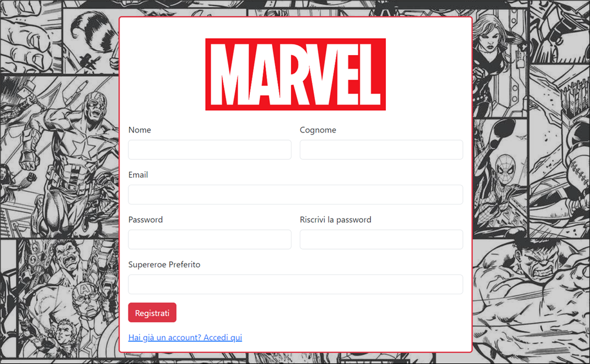

I campi del form vengono validati in due livelli: dispongono della proprietà _required_ ed è stato
implementato uno script di validazione dei campi compilati, nello specifico:

- l’email deve avere il formato testo@testo.testo;
- la password deve essere almeno 8 caratteri, e contenere almeno una lettera maiuscola, una
    minuscola, ed un numero;
In caso di mancanze, i messaggi di errore vengono mostrati all’utente indicando cosa non vada bene:

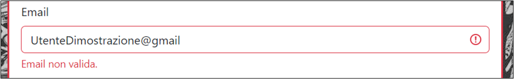
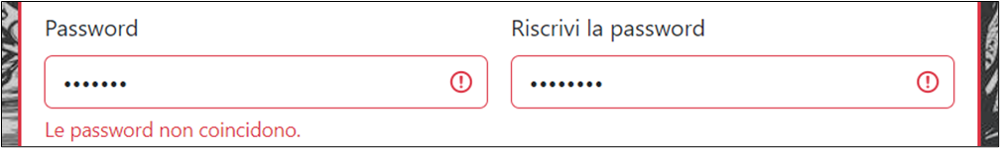

**Login** – login.html
Una volta registrato con successo, l’utente viene reindirizzato alla pagina di login, dove potrà utilizzare
le credenziali appena utilizzate per l’iscrizione per accedere alla piattaforma.

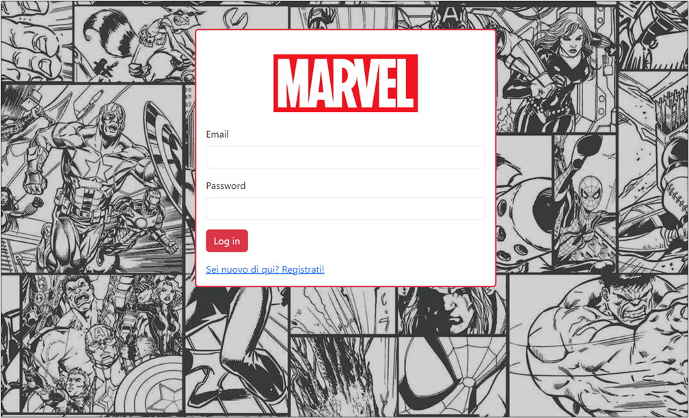

Anche qui il form è molto semplice, i due campi sono _required_ , e da qui si hanno due diramazioni in
base a come va il tentativo di autenticazione:

- nel caso di successo, si ha un reindirizzamento alla homepage con tutti i dati dell’utente
    all’interno del localStorage, in modo tale da poter accedere velocemente ad alcuni dati utili;
- nel caso di insuccesso, si mostra un alert contenente il motivo del fallimento;


**Homepage** – home.html
Questa pagina è la “radice” del sito web, e non contiene informazioni importanti, ma da il benvenuto
all’utente e fornisce una breve introduzione.

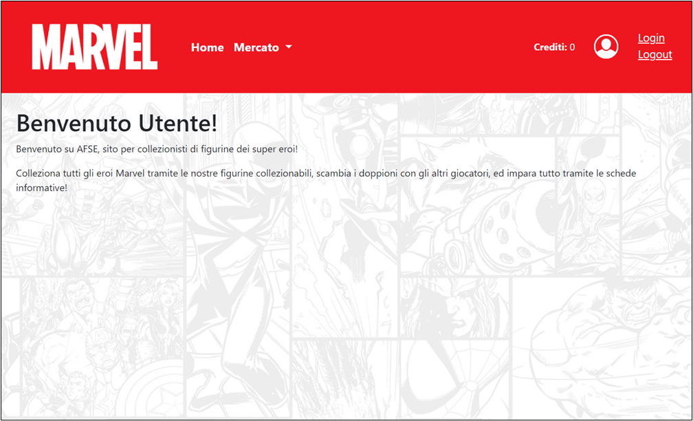

Presenta una navbar che fa da menu all’utente: è possibile visualizzare come viene popolata nel file
‘ _Progetto AFSE/frontend/javascript/new-navbar.js_ ’ (nome dovuto al fatto che si tratta di una seconda
versione di questo oggetto). Questa navbar viene popolata in base alla presenza dell’accesso di un
utente o meno, ed in base al privilegio dell’utente: ciascun utente dispone di un campo ‘ _dev’_ , che se
settato a true indica un utente amministratore, che potrà accedere ad una funzionalità aggiuntiva.

Navbar per guests:


Navbar per amministratori:


**Profilo utente** – scheda-utente.html
Cliccando sull’icona dell’utente situata nella parte destra della navbar, l’utente può accedere al
proprio profilo, visualizzando i propri dettagli, le funzionalità di gestione del proprio profilo, ed il
proprio album di figurine.

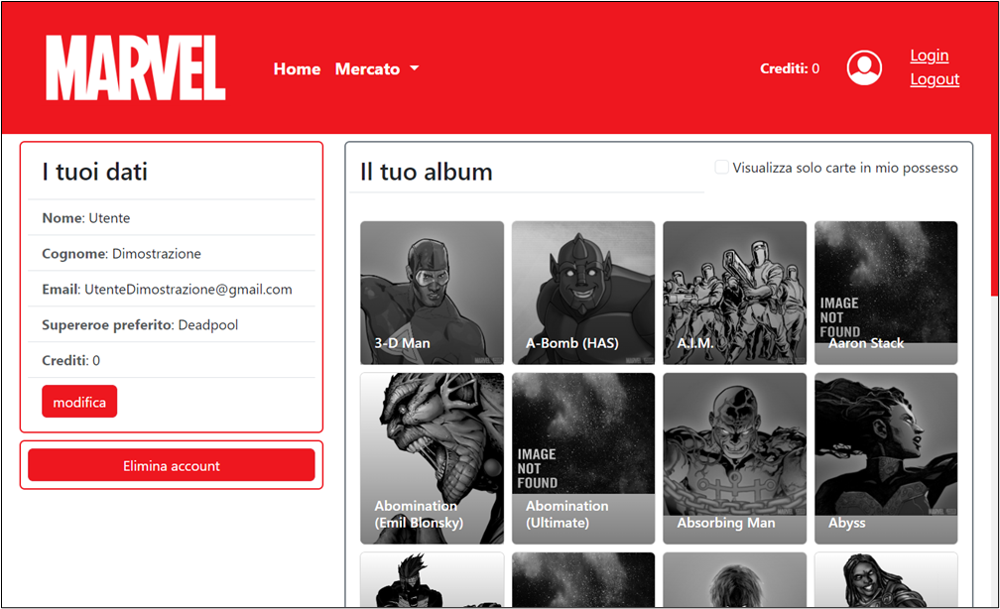

- **modifica dati dell’utente** : l’utente può modificare i propri dati (anche qui è presente un form con validazione:
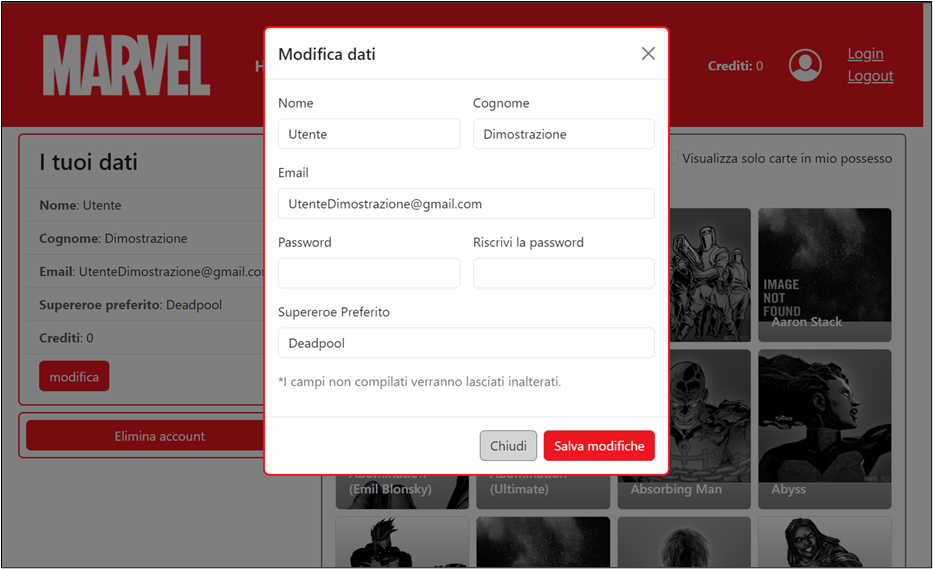

- **cancellazione del profilo utente** : l’utente può cancellare il suo intero profilo. Viene implementata tramite un modal di Bootstrap per chiedere la conferma:
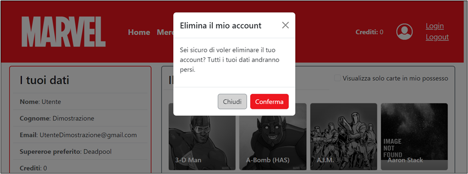

- **visualizzazione dell’album** : l’album di figurine viene popolato in pagine da 24 figurine,
    ammontando a 66 pagine sfogliabili tramite i pulsanti appositi al fondo.
    Le figurine non in possesso sono in bianco e nero, mentre quelle in possesso sono visualizzate
    a colori, con anche la quantità e, in caso la quantità ecceda 1, un pulsante che permette
    all’utente di vendere una copia per 2 crediti:
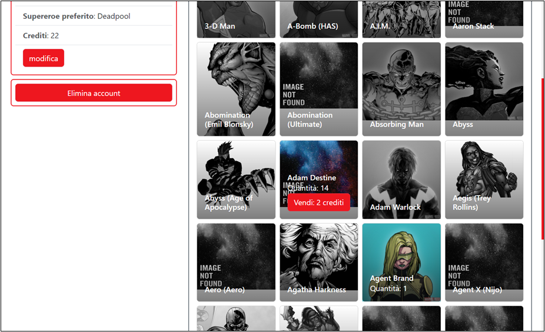

A causa della lentezza dell’API della Marvel durante il lavoro, ho ritenuto sconveniente implementare
una funzione di ricerca dei super eroi per nome, ma considerando l’altrettanta sconvenienza per un
utente di sfogliare 66 pagine, ho implementato un check che permette di visualizzare solamente le
carte in proprio possesso, tutte in una singola pagina, in ordine alfabetico per poterli cercare in
maniera più agevole:
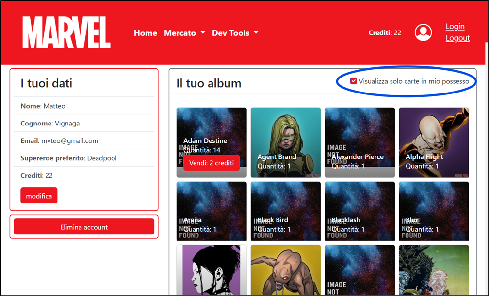

**Dettagli degli eroi** – scheda-eroe.html
Cliccando sulla figurina corrispondente, l’utente viene indirizzato alla scheda dell’eroe, che mostra la
thumbnail a colori, il nome e la descrizione. Nel caso in cui l’utente disponga di questo super eroe nel
suo album, può anche visualizzare Series, Comics ed Events:

Pagina per un super eroe presente nell’album:

Pagina per un super eroe non nell’album:


**Crediti** – mercato-crediti.html

Per l’acquisto dei pacchetti di figurine, l’utente deve prima acquistare dei crediti. Per farlo, può
accedere alla sezione _mercato > crediti_ dal menu della navbar. Qui potrà vedere un semplice form con
una select dei formati acquistabili disponibili: alla selezione della quantità desiderata, viene
automaticamente aggiornato il totale per l’acquisto.

Per l’acquisto in sé, è sufficiente cliccare _‘acquista’_ per vedersi accreditati i punti. Ho ritenuto
superfluo aggiungere una procedura di registrazione di dati bancari fittizi perché non sarebbe
necessaria alcuna validazione: allungherebbe la registrazione, e complicherebbe la composizione
dello schema degli utenti.

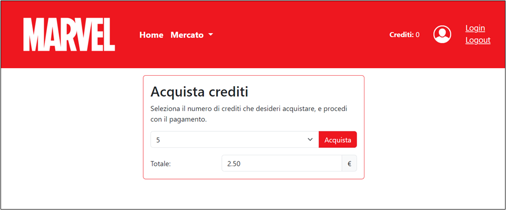

All’acquisto, viene effettuata una semplice update sull’utente per aggiornare i crediti: se va a buon
fine, viene aggiornato tutto per mostrare i nuovi crediti nella navbar.


**Pacchetti di figurine** – mercato-pacchetti.html

La sezione _mercato > pacchetti_ di figurine mostra tutte le offerte di pacchetti di figurine disponibili: il
pulsante di acquisto permette di selezionare un oggetto con costo e numero di carte precisi. Da qui, si
verifica se l’utente ha abbastanza crediti, ed eventualmente si procede all’acquisto, mostrare tutte le
figurine trovate tramite un modal, ed ad aggiornare l’album utente per inserire le figurine.
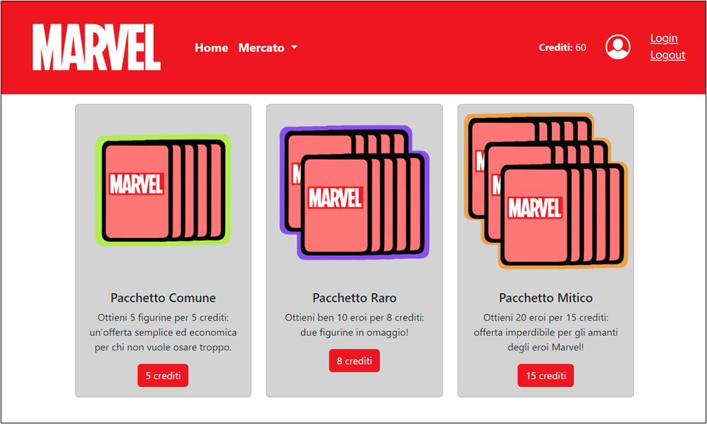
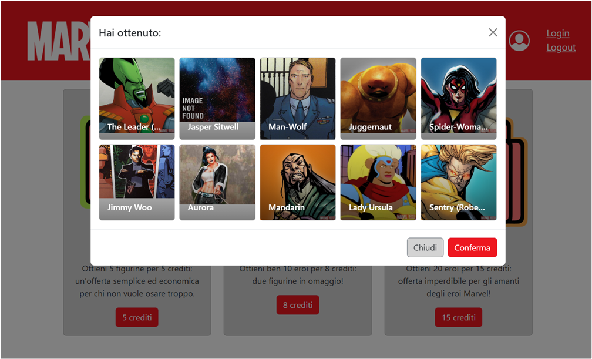

**Mercato degli scambi**

Questa sezione del menu si divide in più parti:

1. postare le proprie offerte di scambio;
2. visualizzare/accettare/rifiutare le proposte ricevute a ciascuna offerta;
3. visualizzare le offerte postate dagli altri utenti per proporre degli scambi alle loro offerte;

**Postare le proprie offerte di scambio** – mercato-scambi.html

Ogni utente può postare le proprie offerte di scambio: ciascuna offerta può contenere molteplici
figurine, una per super eroe, a patto che ciascuna abbia almeno un doppione. Le figurine di cui l’utente
non possiede doppioni non vengono mostrate all’interno del modulo per selezionare le carte, dunque
non può offrirle.

All’aggiunta della propria offerta, le carte messe sul mercato vengono detratte dall’album, almeno in
via temporanea: cancellare l’offerta permette di riottenerle.

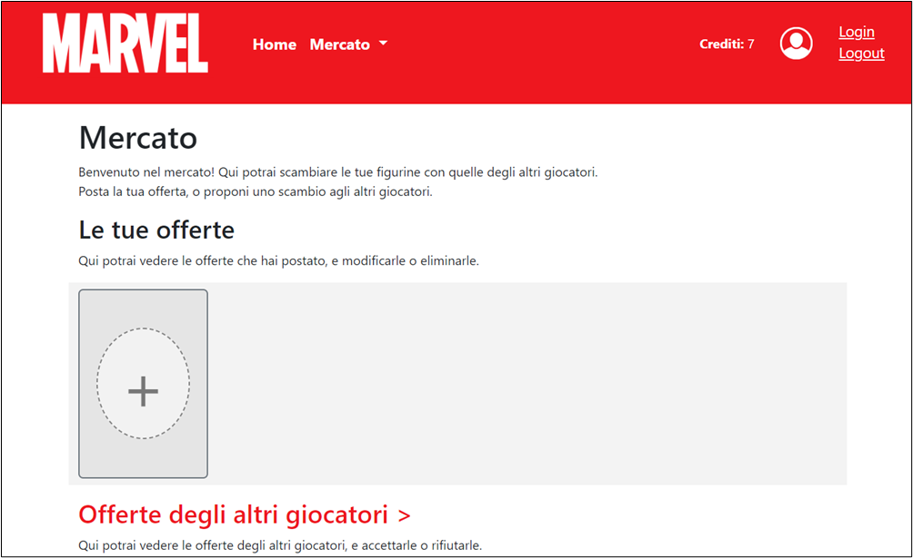

La selezione permette di visualizzare una lista di nomi sulla destra e di avere un contorno rosso alle
carte selezionate. Postando un’offerta con più carte si possono vedere tutte le carte scorrendo
orizzontalmente la sezione delle thumbnail:
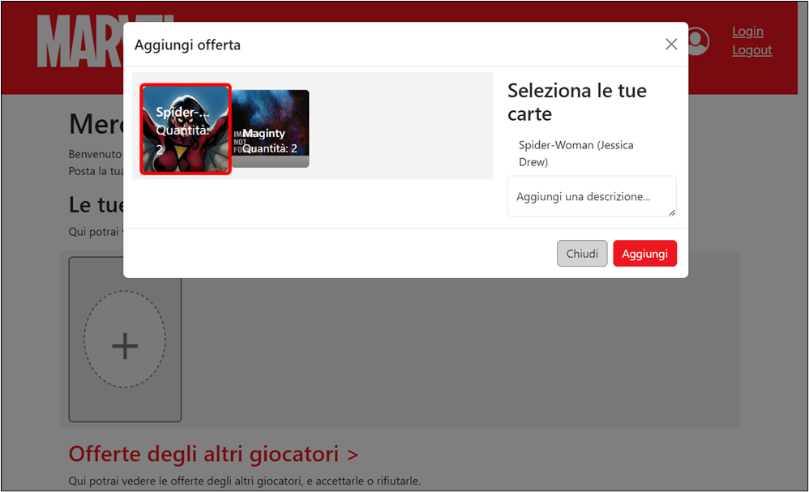
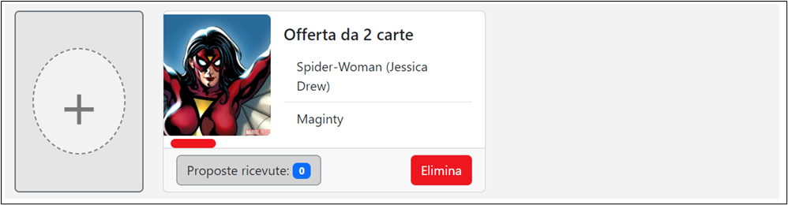

Come si può notare, c’è un pulsante che mostra quante proposte sono state ricevute, e cliccandoci
sopra si potrà accedere alla scheda dell’offerta, visualizzandone i dettagli e tutte le proposte relative
ad essa.
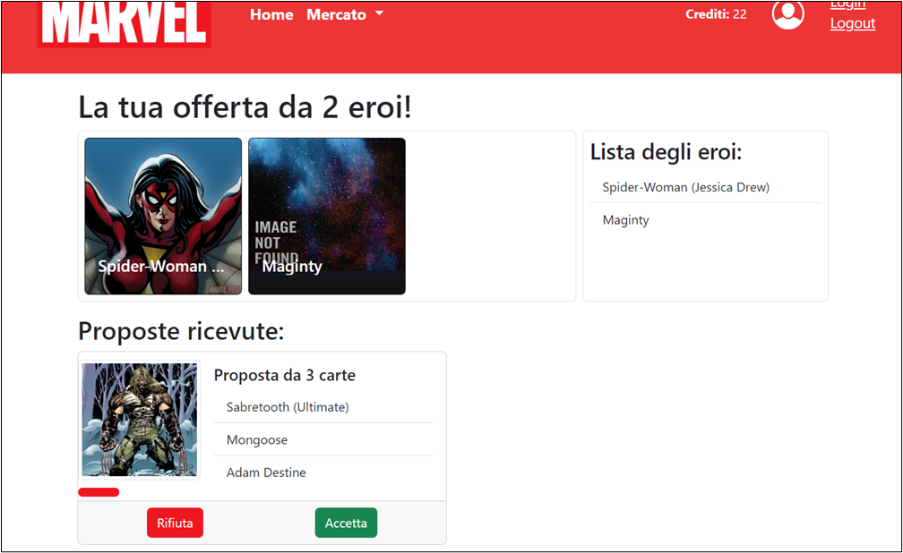
Accettare una proposta avvia lo scambio, cancellando l’offerta e restituendo le carte a chiunque abbia
fatto una proposta.
Rifiutare una proposta restituisce le carte all’utente proponente.


**Mercato degli altri utenti** – mercato-scambi-altri-utenti.html

Cliccando sul link della pagina iniziale della pagina di scambio figurine, l’utente può accedere al
mercato, una lista di tutte le offerte di tutti gli altri utenti. A ciascuna di queste offerte, l’utente potrà
effettuare una proposta. Anche per le proposte, l’utente può selezionare più carte
contemporaneamente, a patto che siano eroi differenti e di cui si possieda più di una sola figurina.

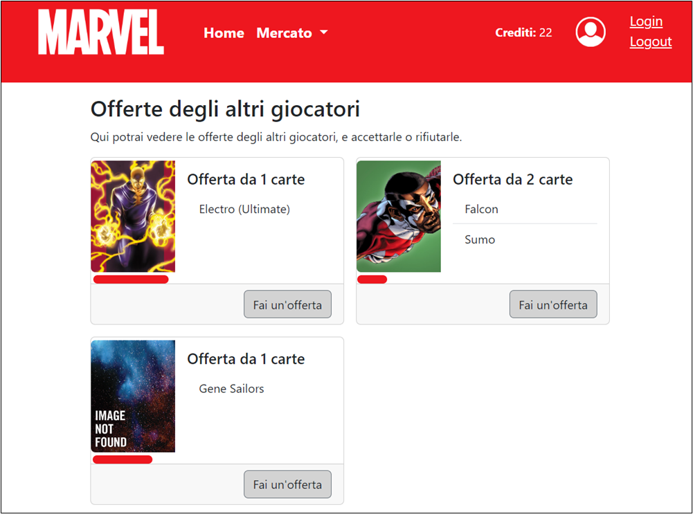

In ciascuna delle pagine illustrate precedentemente, l’accesso di un utente guest causerà ogni
pulsante ad essere settato a _disabled_ , in modo tale da non consentire alcun tipo di operazione.


**Utente amministratore**

Il campo ‘dev’ di un oggetto Utente va a rappresentare un **utente developer** , a cui vengono concessi
privilegi amministrativi. Questo utente ha a disposizione una voce in più nella navbar, i ‘ _dev tools’_. Al
momento, è stata implementata solamente la funzionalità di aggiunta di offerte di pacchetti di
figurine, ma è facilmente estendibile.

Ho optato per lo switch manuale di un utente a dev: si potrebbe semplicemente aggiungere un check
al form di registrazione, ma permetterebbe a qualunque utente generico di accedere ai dev tools,
quindi per semplicità di implementazione, un utente amministratore deve anche poter “mettere
mano” ai propri dati nel database.

In questa pagina aggiuntiva troviamo un altro form con i dati necessari per l’aggiunta dei dati, tra cui
un’immagine, la quale verrà immagazzinata direttamente in mongoDB tramite la conversione a
base64.

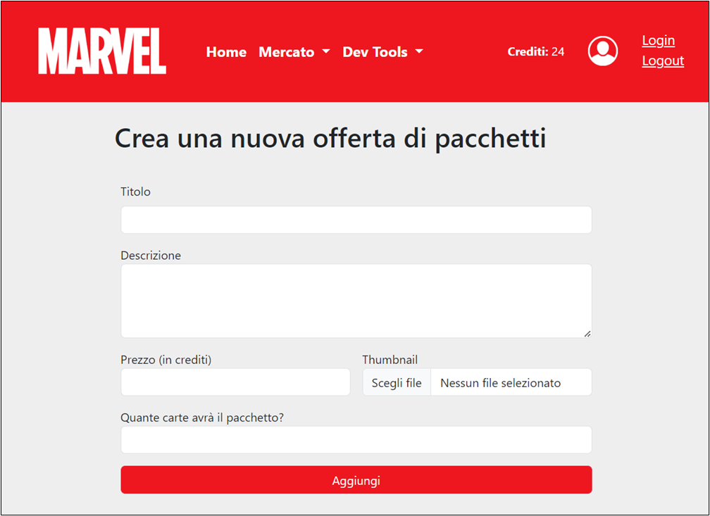

## Backend

Il backend della piattaforma si basa su NodeJS, che interagisce con l’API della Marvel ed il database
MongoDB.

I moduli utilizzati sono gli stessi di quelli visti a lezione, con alcuni accorgimenti:

- il middleware _express.json()_ viene utilizzato aumentando il limite di dimensione dei pacchetti a
    10MB, per poter sfruttare l’invio di immagini in formato base64 nella creazione dei pacchetti di
    figurine;
- alcune route più complesse utilizzano le **transizioni** di mongoDB: a causa della complessità di
    alcune operazioni, che richiedono operazioni di modifica su più documenti o collection
    differenti, ho deciso di rafforzare l’ _atomicità_ tramite le transazioni. E’ sufficiente far partire una
    sessione, e tramite la sessione far iniziare una transizione. Una volta eseguite tutte le
    operazioni, si fa il commit. In caso di errore, si può abortire la transazione, revocando tutte le
    modifiche.
    In questo modo, al fallimento di una singola operazione, si può eseguire un rollback.
    Questa soluzione permette di mantenere i dati _consistenti_ tra tutti i documenti e le collection.

Lo swagger che permette di testare le route si trova all’endpoint _‘/swagger’_ , e dispone di vari schema:

```
**getUserSchema** : {
    $nome: 'Matteo',
    $cognome: 'Vignaga',
    $email: 'mvteo@gmail.com',
    $password: 'password',
    $eroe_preferito: 'Spiderman',
    $album: [],
    $carte_da_scambiare: []
}
```
```
**putUserSchema** : {
    nome: 'Matteo',
    cognome: 'Vignaga',
    email: 'mvteo@gmail.com',
    password: 'password',
    eroe_preferito: 'Spiderman',
    album: [],
    carte_da_scambiare: []
}
```

```
**putCardSchema** : {
    quantita: 1
}
```

```
**offerSchema** : {
    $offerente: '66b48f9839c932492aa49a83',
    descrizione: 'Offerta di scambio',
    $carte_offerte: [],
    offerte_ricevute: []
}
```

```
propostaSchema : {
    $proponente: '66b48f9839c932492aa49a83',
    $carte_proposte: []
}
```
```
packSchema : {
    $titolo: 'Pack di carte',
    descrizione: 'Qui puoi descrivere l\'offerta di
    carte, se vuoi',
    $prezzo: 5,
    $quantita_carte: 5,
    $thumbnail: 'base64 di un\'immagine'
}
```
```
cardSchema : {
    $id: 1009718,
    $name: 'Wolverine',
    description: 'Mutante con artigli di
    adamantio',
    $thumbnail:
    'http://i.annihil.us/u/prod/marvel/i/mg/2/60/537bca
    ef0f6cf.jpg'
}
```

**Accesso a MongoDB Atlas** <br>
E’ possibile accedere al database e conseguentemente alle collections creando un account MongoDB ed utilizzando il proprio link per la variabile d'ambiente `DATABASE_URI`.

**Ultima nota** : utilizzo di **localStorage** e **sessionStorage**.
A causa di alcuni problemi riscontrati con la velocità di risposta di MongoDB e Marvel API, ho deciso di
ricorrere a localStorage per i dati utente ed a sessionStorage per vari dati utili a popolare la pagina (es.
i 24 eroi di ogni pagina dell’album nella scheda utente). Questa soluzione complica leggermente gli
script delle pagine, ma permette di risparmiare molto tempo di attesa.


